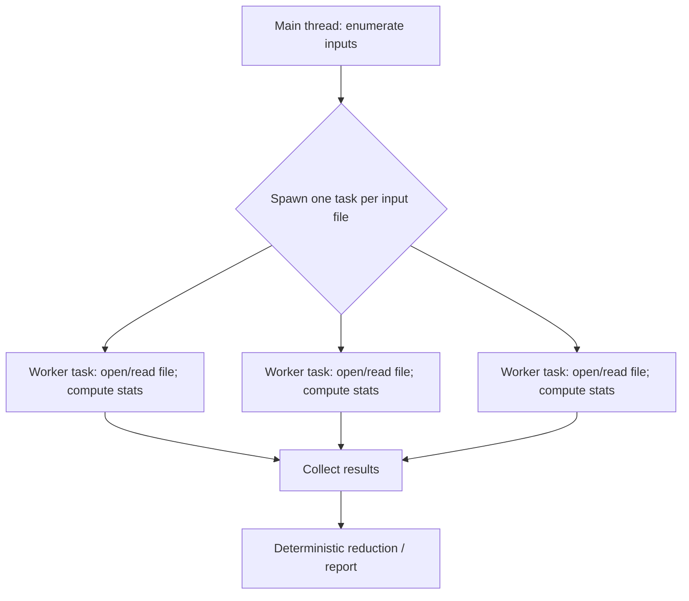
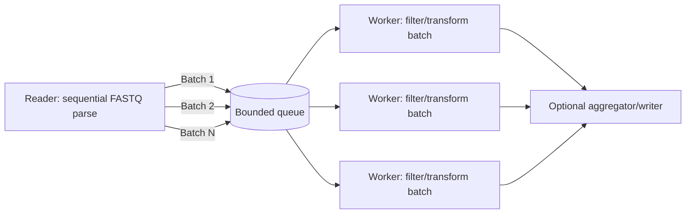

Nim’s historical `std/threadpool` is deprecated in favor of Nimble packages such as **malebolgia**, **taskpools**, and **weave**, 
and Nim’s own thread docs explicitly recommend these higher-level libraries over raw threads. 

For bioinformatics CLIs (e.g., FASTQ/FASTA utilities, BAM coverage calculators), the “right” library is less about raw speed and more about how 
safely you can move data between threads under Nim’s modern memory model (default `--mm:orc`) and how predictably the runtime behaves under I/O-heavy workloads.

Across the three:

* **malebolgia** is the best “developer ergonomics” choice for typical bioinformatics workloads that are dominated by coarse-grained parallelism (one file per task, or medium-sized batches of records) and benefit from **structured concurrency** (everything spawned inside one `awaitAll` barrier), **bounded queue/backpressure**, and built-in **cancellation/timeouts**. It also records failures from worker threads and surfaces them when the `awaitAll` finishes, and it includes compiler-time checks that reject dangerous “reuse” patterns (a common source of subtle race bugs). citeturn2view3turn23view0

* **taskpools** is the best choice when you want a **small, auditable work-stealing thread pool** intended for compute work, with a tight API (`new`, `spawn`, `sync`, `syncAll`, `shutdown`) and strong safety constraints: tasks are built via a `toTask` macro that uses `std/isolation` to isolate arguments, and task callbacks are declared `raises: []`, effectively pushing you toward explicit error values (e.g., `Result[T,E]`) rather than exceptions. citeturn4view2turn11view0turn11view2 It is also explicit that you should avoid doing blocking I/O on the compute pool because the pool can “soft-lock” if all threads block. citeturn11view2

* **weave** is the most feature-rich and performance-oriented runtime: it provides **task parallelism** (`spawn`/`sync`), **data parallelism** (`parallelFor` and variants), and **dataflow/pipeline parallelism** via events, with a design emphasizing very low overhead and message passing. citeturn17view0turn3view4 However, it carries sharper edges for bioinformatics: it states it has **not been tested with GC-managed types** (strings/seqs) and recommends passing pointers or using channels, and it warns against blocking/sleeping in worker threads because it can stall scheduling. citeturn3view1turn17view0 Additionally, its latest tagged release (`v0.4.10`) dates to **Dec 9, 2023**, so you should treat it as a powerful but higher-risk dependency for production bioinformatics tools unless you can invest in thorough validation. citeturn20view0

Pragmatically for bioinformatics: per-file parallelism (multiple FASTQs/BAMs in a run, or per-contig operations) is usually the first and safest win;
intra-file record-level parallelism often requires a producer/consumer design to preserve record boundaries and avoid fighting decompression and streaming constraints 
(especially with gzip). This is consistent with common pipeline practice:
many workflows gain more from parallelizing across splits/files than by adding more threads to one monolithic stream.

## Libraries overview and API comparison

### Nim threading context that matters for these libraries

Nim’s default memory manager is **ORC** (`--mm:orc`). The ORC design relies on **moving isolated subgraphs between threads** rather than using atomic reference counting, 
and Nim documents that RC ops “do not use atomic instructions” because “entire subgraphs are moved between threads.” 

The standard library’s **`std/isolation`** module formalizes this with `Isolated[T]` (a `sendable` move-only wrapper) and `isolate/extract` operations
checked at compile time.

This has direct implications when you process FASTQ/FASTA records (strings/seqs) in parallel:

- If your runtime/library *automatically isolates* task arguments, you can often work with “normal” Nim types while staying safe under ORC.
- If it does *not*, you may need to pass pointers, use explicit isolation, or structure your code so that GC-managed objects never cross thread boundaries.

### Concurrency models and APIs

**malebolgia (Araq)** centers on a `Master` object and **structured concurrency**: you create a master, then
spawn tasks inside an `awaitAll:` block that acts as a barrier. It “detaches the notion of ‘wait for all tasks’ from the notion of a ‘thread pool’,” 
supports cancellation/timeouts, and emphasizes bounded memory/backpressure. 
It deliberately has “no FlowVar concept” and is designed around waiting for all tasks in a scope. 
Internally, it uses a global fixed-size queue (`FixedChanSize` is an `intdefine`) and a fixed worker thread pool size (`ThreadPoolSize` is an `intdefine`), implementing backpressure when the queue fills. 

**taskpools (status-im/nim-taskpools)** implements a shared-memory work-stealing task pool designed for compute-intensive tasks, 
emphasizing auditability and energy efficiency (threads “spindown” by parking). 
The public API includes `Taskpool.new`, `spawn`, `sync`, `syncAll`, and `shutdown`, and tasks are processed approximately in **LIFO** order. 
A key design decision: the implementation is wrapped in `{.push raises: [], gcsafe.}` and tasks/callbacks are declared `raises: []` (no exceptions), which means error propagation should be done with explicit returned values or other non-exception mechanisms. 

**weave (mratsim)** is a larger runtime offering three parallelism models: (1) task parallelism (`spawn`/`sync`), (2) data parallelism (`parallelFor`), and (3) dataflow parallelism (delayed tasks / events). citeturn15view0turn17view0turn3view4 Workers are created per logical core and the thread count can be configured with `WEAVE_NUM_THREADS`. citeturn3view4turn17view0 Weave also exposes `syncRoot(Weave)` as a global barrier; its own state-machine source notes it is valid only in the root task/main thread and misuse can lead to undefined behavior. citeturn10view1turn17view0

### Comparative table of key attributes

| Library | API model | Typical overhead profile | Maturity signals | I/O & streaming posture | Best-fit bioinformatics use-cases |
|---|---|---|---|---|---|
| **malebolgia** | Structured concurrency: `createMaster()`, `m.awaitAll: ... m.spawn ...` (no FlowVar).  | Coarse tasks are ideal; bounded fixed-size queue provides backpressure; may execute tasks on the master thread unless `activeProducer=true`.  | Latest release page shows `1.3.2` as latest (recent activity), and release notes include multiple contributors. | Good for a main-thread producer feeding work; `activeProducer` can reserve the master for I/O but warns it can deadlock recursive patterns.  | Per-file parallelism; bounded batch processing; workflows that want cancellation/timeouts and tighter “spawn scope” correctness.  |
| **taskpools** | Task parallelism only: `tp = Taskpool.new(numThreads=...)`; `tp.spawn f(x)` → `Flowvar[T]`; `sync(flowvar)`; `syncAll()` / `shutdown()` root only.| Work-stealing; energy-efficient parking; not optimized for extremely tiny tasks; memory allocated “as-needed” (vs weave pooling). | Tagged `v0.1.0` on May 6, 2025; active CI updates mentioned in release notes. citeturn21view1turn16view0 | Explicitly warns: avoid blocking I/O on compute pool or it can “soft-lock” if all threads block. citeturn11view2 | Compute-heavy per-file tasks; deterministic/auditable concurrency; batch-parallel record processing with explicit backpressure implemented by you.  |
| **weave** | Task + data + dataflow: `init(Weave)`/`exit(Weave)`; `spawn`/`sync`; `parallelFor`; `FlowEvent`-based dependencies; `syncScope`. | Designed for very low runtime overhead and scalable scheduling; optional metrics; supports lazy flowvars to cut overhead for very fine tasks (with constraints). | Latest tag `v0.4.10` is Dec 9, 2023; large repo with many components; explicitly “experimental” disclaimers about verification. | “Not tested with GC-ed types”; recommends pointers or channels; warns against blocking/sleeping in threads (scheduler can stall). | Data-parallel kernels (k-mer transforms, SIMD-friendly loops), CPU-bound loops and pipelines where you can keep data in raw buffers/pointers and avoid blocking calls. |

## Bioinformatics integration patterns and code snippets

The two patterns you asked for—**per-file parallelism** and **record-level chunking**—map naturally to “coarse tasks” vs “bounded batches.” In practice, a FASTQ/FASTA parser must preserve record boundaries; Nim tooling like **nimreadfq** provides an iterator `readFQ()` that supports stdin, gzipped, and plain files, and also offers a `readFQPtr()` mode that returns pointer-based records but reuses memory between iterations (unsafe to pass across threads without copying). citeturn13search0 SeqFu’s own docs note it uses Heng Li’s parsing approaches (`klib.nim` / `readfq`) for performance.

### Mermaid diagrams for task flow

Per-file parallelism is simplest:



Record-level chunking is usually a producer/consumer pipeline:



### malebolgia snippets

#### Per-file parallelism (one file per task)

```nim
# nim c -d:release --threads:on --mm:orc mytool.nim
# Optional tuning:
#   -d:ThreadPoolSize=8 -d:FixedChanSize=32
import malebolgia
import std/[strformat]

# Example placeholder: replace with BAM/FASTQ logic
type FileStats = object
  path: string
  nLines: int

proc countLines(path: string): FileStats {.gcsafe.} =
  result.path = path
  for _ in lines(path):
    inc result.nLines

proc main(files: seq[string]) =
  var m = createMaster()          # supports timeouts/cancel; see createMaster docs citeturn23view0
  var stats = newSeq[FileStats](files.len)

  m.awaitAll:
    for i, f in files:
      m.spawn countLines(f) -> stats[i]

  for s in stats:
    echo &"{s.path}\t{s.nLines}"

when isMainModule:
  main(@["reads1.fq", "reads2.fq"])
```

Why this fits malebolgia: it is explicitly designed around an `awaitAll` barrier and a “no FlowVar” approach, which matches the per-file pattern well. 
#### FASTQ chunking (bounded batches with backpressure)

This pattern keeps I/O in the master thread and spawns **batch compute** tasks. malebolgia’s internal queue is fixed-sized and blocks when full (`FixedChanSize`), which naturally provides backpressure when you spawn faster than workers can consume. 

```nim
import malebolgia
import std/[strformat]

# Pseudo-record; substitute with nimreadfq FQRecord if desired (see notes below)
type FastqRec = object
  name, seq, qual: string

type Batch = seq[FastqRec]
type BatchStats = object
  nReads: int
  nPassed: int

proc processBatch(b: Batch; minLen: int): BatchStats {.gcsafe.} =
  result.nReads = b.len
  for r in b:
    if r.seq.len >= minLen: inc result.nPassed

proc mainChunked(minLen = 75; batchSize = 10_000) =
  var m = createMaster(activeProducer = true)  # keep master for I/O
  # Warning from malebolgia: activeProducer can introduce deadlocks with recursive loads 

  var inFlight: seq[BatchStats] = @[]
  var tmpResults: seq[BatchStats] = @[]

  m.awaitAll:
    var batch: Batch = @[]
    batch.setLen(0)

    # Replace this with a real FASTQ iterator (nimreadfq.readFQ)
    for i in 0 ..< 200_000:
      batch.add FastqRec(name: $i, seq: "ACGT", qual: "IIII")

      if batch.len == batchSize:
        tmpResults.setLen(tmpResults.len + 1)
        let idx = tmpResults.high
        m.spawn processBatch(batch, minLen) -> tmpResults[idx]
        batch = @[] # new batch object; avoid sharing the same seq across tasks

    if batch.len > 0:
      tmpResults.setLen(tmpResults.len + 1)
      let idx = tmpResults.high
      m.spawn processBatch(batch, minLen) -> tmpResults[idx]

  # reduction after awaitAll finishes
  var totalReads, totalPassed = 0
  for s in tmpResults:
    totalReads += s.nReads
    totalPassed += s.nPassed
  echo &"reads={totalReads} passed={totalPassed}"

when isMainModule:
  mainChunked()
```

Notes:
- If you use **nimreadfq**, `readFQ()` yields string-backed records and supports gzipped input and stdin.  Under ORC, you should still treat the batch as “moved” into a worker and avoid retaining aliases to its internal strings in the producer.
- Don’t use `readFQPtr()` for cross-thread handoff without copying: it is pointer-based and “memory is reused during iterations.” 

### taskpools snippets

#### Per-file parallelism (one file per task)

taskpools uses a classic threadpool + futures (`Flowvar`) approach: create a pool, spawn tasks, then `sync` results. 

```nim
# nim c -d:release --threads:on --mm:orc mytool.nim
import std/[cpuinfo, strformat]
import taskpools

type FileStats = object
  path: string
  nLines: int

proc countLines(path: string): FileStats {.gcsafe, raises: [].} =
  result.path = path
  for _ in lines(path):
    inc result.nLines

proc main(files: seq[string]) =
  let tp = Taskpool.new(numThreads = countProcessors()) # default is countProcessors 
  var futs = newSeq[Flowvar[FileStats]](files.len)

  for i, f in files:
    futs[i] = tp.spawn countLines(f)

  for i in 0 ..< files.len:
    let s = sync futs[i]
    echo &"{s.path}\t{s.nLines}"

  tp.syncAll()  # root thread only 
  tp.shutdown()

when isMainModule:
  main(@["reads1.fq", "reads2.fq"])
```

Key constraints to keep in mind:
- The runtime and tasks are structured to avoid exceptions (`raises: []`); the task infrastructure and pool implementation are defined with `raises: []`. 
- Task arguments are isolated using `std/isolation` in `toTask`, with explicit comments that `refc` cannot move GC-allocated types across thread boundaries. 

#### FASTQ chunking (bounded in-flight futures)

taskpools does **not** provide a built-in bounded work queue; if you spawn millions of tiny tasks, you will accumulate task objects and increase overhead. Its own README positions it as not intended for extremely tiny tasks and compares itself to Weave on this axis. The simplest bioinformatics-friendly approach is to spawn tasks on **batches** and cap the number of in-flight futures.

```nim
import std/[cpuinfo, strformat]
import taskpools

type Batch = seq[string]   # e.g., sequences or pre-parsed records
type BatchStats = object
  nRecords: int
  nPassed: int

proc filterBatch(b: Batch; minLen: int): BatchStats {.gcsafe, raises: [].} =
  result.nRecords = b.len
  for s in b:
    if s.len >= minLen: inc result.nPassed

proc mainChunked(minLen = 75; batchSize = 50_000) =
  let nThreads = countProcessors()
  let tp = Taskpool.new(numThreads = nThreads)

  var inflight: seq[Flowvar[BatchStats]] = @[]
  var totals = BatchStats()

  template drainOne() =
    let r = sync inflight[0]
    totals.nRecords += r.nRecords
    totals.nPassed  += r.nPassed
    inflight.delete(0)

  # Producer loop (replace with real FASTQ iterator)
  var batch: Batch = @[]
  for i in 0 ..< 1_000_000:
    batch.add "ACGT" # placeholder

    if batch.len == batchSize:
      inflight.add tp.spawn filterBatch(batch, minLen)
      batch = @[]

      # Backpressure: keep at most ~2x threads worth of work queued
      if inflight.len >= 2 * nThreads:
        drainOne()

  if batch.len > 0:
    inflight.add tp.spawn filterBatch(batch, minLen)

  while inflight.len > 0:
    drainOne()

  tp.syncAll()
  tp.shutdown()

  echo &"records={totals.nRecords} passed={totals.nPassed}"

when isMainModule:
  mainChunked()
```

Important I/O note: taskpools explicitly warns against doing blocking I/O inside the compute pool because if all threads block on I/O, the pool can make no progress (“soft-locked”). In bioinformatics, this typically means: **parse/stream in the main thread**, and offload compute-heavy transforms/filters to the pool.

### weave snippets

Weave provides the richest primitives (including `parallelFor` and dataflow events), but it also explicitly states it has not been tested with GC-ed types and suggests passing pointers or using channels. For bioinformatics, that usually implies: keep your “record payload” in raw buffers or fixed-size structs (or be prepared to validate GC-heavy usage yourself).

#### Per-file parallelism (spawn/sync)

```nim
# nim c -d:release --threads:on --mm:orc mytool.nim
import weave
import std/[strformat]

type FileStats = object
  nLines: int

proc countLines(path: string): FileStats =
  # Note: Weave warns about GC-ed types; test carefully if passing strings/seqs 
  for _ in lines(path):
    inc result.nLines

proc main(files: seq[string]) =
  init(Weave)
  var futs: seq[Flowvar[FileStats]] = @[]
  for f in files:
    futs.add spawn countLines(f)

  for i, fv in futs:
    let s = sync(fv)
    echo &"{files[i]}\t{s.nLines}"

  syncRoot(Weave) # global barrier on root thread 
  exit(Weave)

when isMainModule:
  main(@["reads1.fq", "reads2.fq"])
```

Weave-specific operational constraints:
- Workers are cooperative; don’t “sleep or block a thread” or the scheduler can stall—Weave explicitly analogizes this to async/await scheduling. 
- Thread count is configurable via `WEAVE_NUM_THREADS`. 

#### FASTQ chunking concept using `parallelFor` + safe buffers

Weave’s own documentation demonstrates that for GC-managed sequences, you often take a pointer to raw buffers for parallel work.  For FASTQ chunking, an approach that fits Weave’s model is:

1. Parse sequentially into a vector of **fixed-size batch descriptors** (e.g., offsets into a big byte buffer, or pointers to batch-owned buffers).
2. Use `parallelFor` over batch indices.

Below is a simplified “descriptor-based” skeleton (the parsing step is domain-specific and should ensure record boundaries):

```nim
import weave
import std/[strformat]

type BatchDesc = object
  # Example: pointer + length into a larger immutable buffer
  p: ptr UncheckedArray[byte]
  n: int

type BatchStats = object
  nRecords: int
  nPassed: int

proc analyzeBatch(b: BatchDesc; minLen: int): BatchStats =
  # parse b.p[0..<b.n] as FASTQ records and compute stats
  discard

proc mainBatches(batches: ptr UncheckedArray[BatchDesc], nbatches: int, minLen: int) =
  init(Weave)

  # expandMacros:
  parallelFor i in 0 ..< nbatches:
    captures: {batches, minLen}
    let s = analyzeBatch(batches[i], minLen)
    # write s into a preallocated results array or reduce with atomics/locks

  exit(Weave)
```

This aligns with Weave’s stance that “we can’t work with seq directly as it’s managed by GC” and that pointer-based buffers are a safe route for parallel code. 

## Performance overheads, scheduling behavior, and GC interactions

### Task granularity and scheduling overhead

Bioinformatics workloads are often either:
- **I/O-bound** (reading gzipped FASTQ, reading BAM/CRAM, writing outputs), or
- **mixed** (I/O plus compute transforms like quality filtering, trimming, k-merization).

The biggest scheduling pitfall is spawning “one task per read” — overhead and memory pressure can dominate. All three libraries implicitly push you toward batching or coarse parallelism:

- **malebolgia** has a fixed-size queue (`FixedChanSize`) that blocks producers when full, naturally limiting outstanding tasks (backpressure). 
- **taskpools** positions itself as not focused on “trillions of very short tasks,” and contrasts with Weave for tiny-task overhead and pooling.
- **weave** explicitly targets very fine granularity and includes mechanisms like lazy flowvars (`-d:WV_LazyFlowvar`) to reduce overhead “by at least 2x” for very fine tasks, though with strict constraints (only word-sized flowvars; cannot be returned). 

malebolgia further exposes a `paralgos` helper with a `bulkSize` parameter and explicitly notes that sending a task to another thread is expensive—bulk size should usually be larger than you think. This is directly relevant to FASTQ record-level parallelism: pick batch sizes that amortize scheduling overhead.

### Thread creation and pool sizing

- **malebolgia** uses compile-time `ThreadPoolSize` (default 8) and a global pool (main thread counts too), plus `FixedChanSize` for queue depth. 
- **taskpools** uses `Taskpool.new(numThreads=...)` defaulting to `countProcessors()`. 
- **weave** creates worker threads per logical core by default and allows `WEAVE_NUM_THREADS` to cap the worker count. 

For bioinformatics tools on shared HPC nodes, prefer:
- explicit `--threads:on --mm:orc`,
- a CLI flag like `--threads N`,
- enforcing `N <= available cores` (from environment or scheduler),
- and using **per-file** parallelism first, then batch-parallelism within a file only when compute dominates.

### GC interactions and “sendable” data

Under `--mm:orc`, safe inter-thread transfer relies on moving isolated subgraphs. The practical consequences:

- **taskpools** leans into this: its `toTask` macro uses `isolate`/`extract` to construct per-task argument scratch objects, and it explicitly blocks GC types under `refc` because refc is thread-local heap based. 
- **malebolgia** imports and exports `std/isolation` and internally uses `std/tasks` (`toTask`) to build tasks, so it is aligned with Nim’s isolation approach at the task boundary. 
- **weave** is more manual: it warns it has not been tested with GC-ed types and suggests using pointers or channels; its examples show taking raw pointers to buffers instead of working on seq directly. 

For bioinformatics developers, the safest cross-library strategy is:
- do not share mutable `seq/string/ref/object` state across threads,
- treat batches as **moved** into tasks (no aliasing),
- use `Isolated[T]` or pointer+len “buffer descriptors” when in doubt.

## I/O strategies, streaming, and error/fault handling

### Streaming FASTQ/FASTA safely

A correct FASTQ splitter must maintain record boundaries. Libraries like **nimreadfq** are optimized for streaming reads and support stdin, gzipped input, and flat files via an iterator API. Heng Li’s **klib.nim** similarly advertises a gzip reader that works with ordinary files and a FASTA/FASTQ parser based on `kseq.h`. These are good building blocks for the *producer* side of a pipeline.

For intra-file parallelism:
- With gzipped FASTQ, decompression is a major bottleneck and naive splitting is hard; modern work has focused on indexing to enable parallel processing of gzipped FASTQ. citeturn12search19
- Therefore, in Nim bioinformatics tools, the most robust design is usually: **single reader** → **bounded batches** → **parallel compute** → **single writer** (if order matters).

### Avoid blocking work-stealing compute pools

Both taskpools and weave explicitly warn against blocking worker threads:
- taskpools notes doing I/O on a compute threadpool should be avoided; if all threads block on I/O, the pool can be soft-locked. 
- weave warns “Don’t sleep or block a thread as this blocks Weave scheduler,” and suggests `syncRoot` and `loadBalance` patterns to prevent starvation. 

In bioinformatics, this typically means:
- keep parsing/decompression in a dedicated thread (often the main thread),
- do compute-heavy transformations in worker tasks,
- and treat output writing as either main-thread work or a separate writer thread (when formatting/output is heavy).

### Fault tolerance and error propagation

**malebolgia** propagates task failures back to the master: worker threads catch exceptions, record the first failure, and `awaitAll` completion raises an error to the caller (the internal error string includes exception name/message and stack trace).  It also supports timeouts/cancellation: `createMaster(timeout=...)` tracks `shouldEndAt`, and on timeout it cancels tasks and raises. 

**taskpools** is intentionally exception-averse: task callbacks and runtime code are defined with `raises: []`.  In practice this means you should model failures as explicit return values (e.g., `Result[BatchStats,ErrorCode]`), or push errors into a shared concurrent error sink guarded by an atomic/lock. This is particularly attractive for bioinformatics utilities where you want “fail-fast with a clean message” without complex cross-thread exception semantics.

**weave** documents extensive synchronization primitives and barriers, but its public docs are not centered on error propagation semantics; given its disclaimer about incomplete formal verification and the warning about GC-ed types, treat “task throws” and “GC type escapes” as scenarios that require explicit testing in your codebase. 

## Recommendations, migration guidance, and benchmark plan

### Recommended library per use-case

For **bioinformatics CLIs that process many files** (multiple FASTQs/BAMs, per-sample workflows): choose **malebolgia** first. Its structured `awaitAll` model maps cleanly to “run these N independent file jobs and then reduce,” it provides bounded backpressure via a fixed-size queue, and it supports cancellation/timeouts for long-running pipelines. 

For **compute-heavy transforms where you want strict auditability and explicit error values** (security/robustness mindset, predictable behavior), choose **taskpools**. Its design emphasizes simplicity, work-stealing scalability, and explicit constraints (no exceptions; isolate arguments). 

For **data-parallel kernels or pipeline-like dependency graphs**, consider **weave** if—and only if—you can keep data in raw buffers/pointers (or you validate GC-heavy usage yourself) and you accept that the latest release tag is from 2023.  Weave becomes compelling for high-throughput numeric loops (`parallelFor`) and controlled compute stages, not for “parse gzipped FASTQ inside worker threads.”

### Migration guidance

If you’re migrating from `std/threadpool`:
- Nim docs mark it deprecated in favor of malebolgia/taskpools/weave. 
- Replace `parallel:` blocks with:
  - malebolgia: `m.awaitAll:` and `m.spawn ... -> resultSlot`
  - taskpools: `tp.spawn` + collect `Flowvar`s + `sync`
  - weave: `init(Weave)` + `spawn` + `sync` (or `parallelFor` for loops)

If you already use raw `Thread`/`Lock`:
- Introduce per-file concurrency first.
- Replace shared mutable state with reduction patterns (per-task local results; reduce at end).
- Where shared aggregation is required, use locks/atomics (malebolgia provides locker utilities, though parts are flagged as “does not work yet” due to hidden isolate calls). 

### Suggested benchmarks to run

Bioinformatics concurrency is extremely workload-specific (compression ratio, disk, record length variance). Here is a benchmark suite that will let you compare these libraries on realistic scenarios without inventing synthetic microbenchmarks.

**Build settings (recommended baseline)**
- `nim c -d:release --threads:on --mm:orc ...` (ORC is Nim default). 

**Benchmarks**
1. **Per-file FASTQ stats** (N independent files; each task parses a whole file and computes counts/length/Q metrics).
2. **Single large FASTQ filtering** (one input; producer parses sequentially; spawn batch compute).
3. **FASTA transform** (often less I/O heavy than FASTQ; measure compute scaling).
4. **BAM coverage per file** (if using htslib wrappers, open one BAM per task—excellent stress test for per-file parallelism cleanly separating state).

**Commands and measurements**
- Wall time and CPU usage: `hyperfine` or `/usr/bin/time -v`.
- Peak RSS, context switches: `/usr/bin/time -v`.
- OS scheduler effects: `perf stat` (instructions, cycles, context-switches, migrations).
- Library-specific metrics:
  - Weave: compile with `-d:WV_metrics` to report internal stats (tasks executed, steal requests, etc.). 
  - malebolgia: sweep `-d:ThreadPoolSize` and `-d:FixedChanSize` to evaluate throughput vs memory/backpressure behavior.
  - taskpools: vary `Taskpool.new(numThreads=...)` and measure sensitivity; it is explicitly designed for compute-intensive tasks and parks idle threads.

**Metrics to collect (minimum set)**
- Throughput: reads/sec (FASTQ), bases/sec, alignments/sec (BAM scanning).
- Tail latency for pipelines: time to first output line (if streaming output is important).
- Peak RSS and allocation pressure (especially if batching stores many strings).
- CPU utilization and context switches (helps detect oversubscription or blocking in worker threads).

Because weave and taskpools warn against blocking worker threads, include at least one benchmark variant where parsing stays in the main thread and compute is offloaded, and one “naive” variant where each worker opens/reads independently—this often reveals the practical limits of the runtime for bioinformatics I/O
